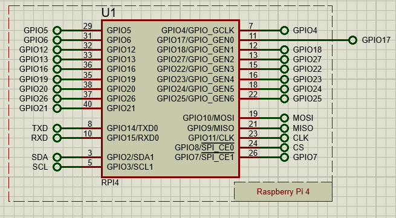
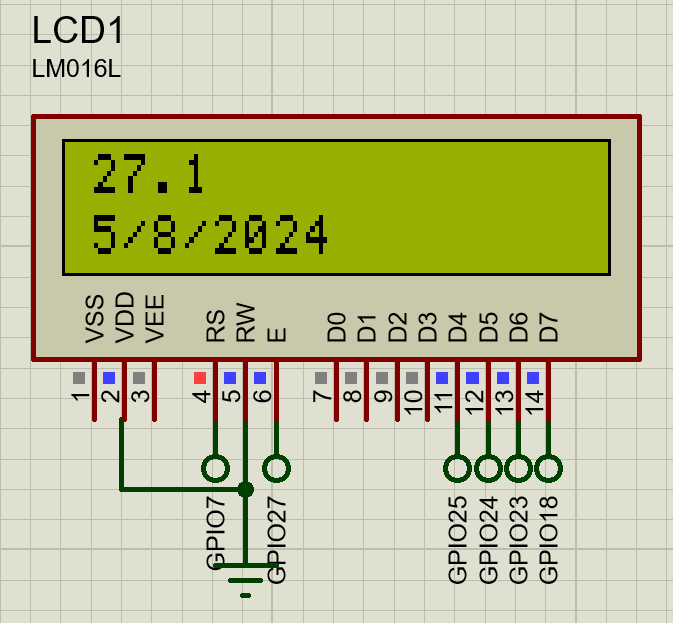
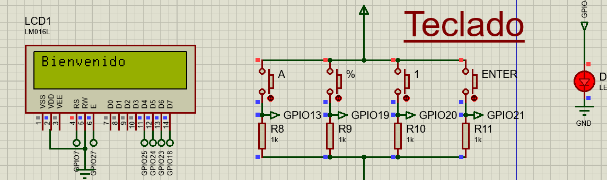
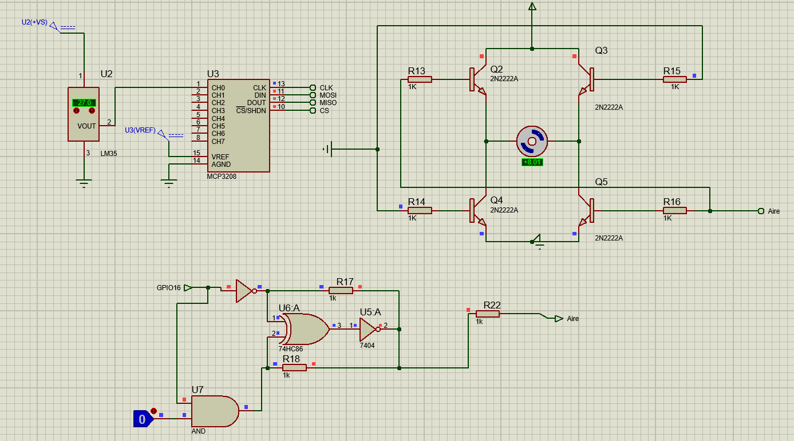
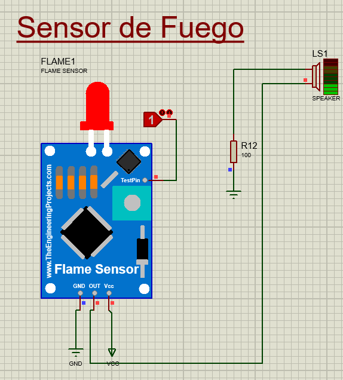
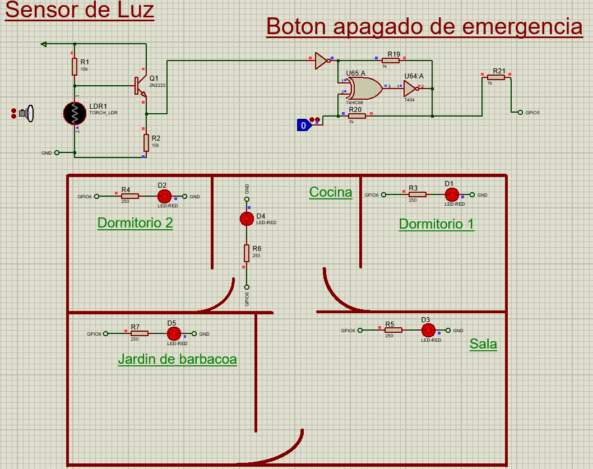
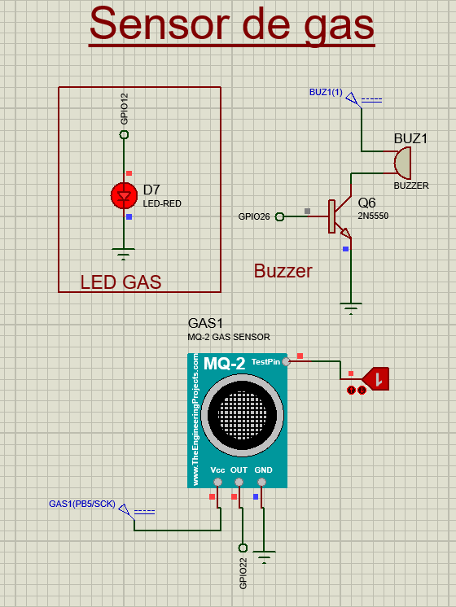

# Manual Tecnico
Para la ejecución de la practica 1 se utilizo el prgrama de simulación Proteus, en el cual se hace uso de una Raspberry Pi 4 para la implementación de domotica. De las cuales se cuenta con 5 areas diferentes.

A continuación se muestra una captura de pantalla de la Raspberry Pi 4 en el sistema de simulación Proteus:



Para poder utilizar la raspberry en la simulación se hizo uso de los pines:

| **LCD** | **Teclado de Ingreso** | **Sensor de Luz** | **Sensor de Temperatura** | **Sensor de Llamas** | **Sensor de Gas** |
| ------- | ---------------------- | ----------------- | ------------------------- | -------------------- | ----------------- |
| GPIO7   | GPIO13                 | GPIO5             | GPIO16                    | GPIO17               | GPIO22            | 
| GPIO27  | GPIO19                 | GPIO6             |                           |                      | GPIO12            |
| GPIO25  | GPIO20                 |                   |                           |                      | GPIO26            |
| GPIO24  | GPIO21                 |
| GPIO23  | GPIO4                  |
| GPIO18  |

## LCD

Para poder mostrar la información necesaria al usuario se utilizo la pantalla LCD *LM016*. Esta pantalla se mantiene mostrando la temperatura actual que obtiene del sensor de temperatura en la sala y a su vez muestra la fecha actual:



## Entrada Principal
Para asegurar la seguridad de la entrada principal se diseño un sistema con tre diferentes botones y solo al ingresar la secuencia correcta de los botones se da acceso a la casa.

Para manejar el teclado de los botones de acceso, para mandar la letra _A_ se utilizo el pin GPIO13 para mandar una señal positiva a la Raspberry cuando este botón es presionado, para la tecla _%_ se usó el pin GPIO19, para la tecla _1_ se usó el pin GPIO20 y para la tecla _Enter_ se usó el pin GPIO21.
```python 
def check_password_input():
    global Password_comparar
    while True:
        if GPIO.input(ky_A) == GPIO.HIGH:
            Password_comparar += 'A'
            pio.uart.println("tecla presionada A")
            sleep(0.05)
        elif GPIO.input(ky_porcentaje) == GPIO.HIGH:
            Password_comparar += '%'
            pio.uart.println("tecla presionada %")
            sleep(0.05)
        elif GPIO.input(ky_uno) == GPIO.HIGH:
            Password_comparar += '1'
            pio.uart.println("tecla presionada 1")
            sleep(0.05)

        if GPIO.input(ky_enter) == GPIO.HIGH:
            pio.uart.println("tecla presionada Enter")
            if Password_comparar == Password:
                lcd_string("Bienvenido", LCD_LINE_1)
                lcd_string("", LCD_LINE_2)
                pio.uart.println("Contrasenia correcta")
                GPIO.output(led, GPIO.HIGH)
                Password_comparar = ''
                sleep(0.05)
                GPIO.cleanup()
            else:
                Password_comparar = ''
                pio.uart.println("Contrasenia incorrecta")
                lcd_string("Contrasenia", LCD_LINE_1)
                lcd_string("incorrecta", LCD_LINE_2)
                GPIO.output(led, GPIO.LOW)
                sleep(0.05)
                GPIO.cleanup()
            return True
        return False
```

Como se muestra en el codigo, al presionar una tecla el caracter se concatena a una variable de tipo _String_ que se encuentra vaciá y al presionar la tecla _Enter_ se hace la comparación del _String_ ingresado con la contraseña ya guardada en el sistema.

Al ingresar la contraseña correcta se envia una señal al pin GPIO4 y se activa una led indicando que el acceso fue exitoso a la vez que se muestra un mensaje en la pantalla LCD:



De ingresar la contraseña incorrecta se muestra en la pantalla LCD que la contraseña es incorrecta y no se permite el acceso a la casa.

## Sala
En la sala se cuenta con un sensor de temperatura *LM35*. Una vez este marca una temperatura de 27°C o mayor se activa un motor DC indicando que el aire acondicionado fue activado.

A su vez se cuenta con un botón capaz de encender y apagar el aire acondicionado, este botón funciona unicamente si la temperatura de la sala es 27°C o mayor.



```python
def chek_sensor_temp():
    GPIO.cleanup()
    while True:
        temp_level = ReadChannel(temp_channel)
        temp = ConvertTemp(temp_level, 2)
        if temp >= 27:
            GPIO.output(AIR_PIN, GPIO.HIGH)
            lcd_string(f"{str(temp)}", LCD_LINE_1)
            lcd_string(f"{str(now.day)}/{str(now.month)}/{str(now.year)}", LCD_LINE_2)
            sleep(0.5)
            GPIO.cleanup()
        else:
            GPIO.output(AIR_PIN, GPIO.LOW)
            lcd_string(f"{str(temp)}", LCD_LINE_1)
            lcd_string(f"{str(now.day)}/{str(now.month)}/{str(now.year)}", LCD_LINE_2)
            sleep(0.5)
            GPIO.cleanup()
```

Se hace uso de una validación simple del valor de temperatura leido y si es mayor o igual a 27 se manda una señal positiva al pin del aire acondicionado GPIO16 y con el uso de la libreria *datetime* se obtiene la fecha del día y se muestra en la pantalla LCD. Si la temperatura disminuye por debajo de los 27°C entonces se deja de mandar la señal positiva al pin GPIO16 y se apaga el aire acondicionado.

## Cocina

Por seguridad en la cocina se cuenta con un sensor de llamas y al detectar cualquier indicio de un incendio se envia una señal positiva que activa un *Speaker* para poder alertar la detección de fuego.



```python
def check_sensors():
    sensor_triggered = False
    while True:
        # Detección de fuego
        if GPIO.input(FLAME_PIN) == GPIO.HIGH:
            pio.uart.println("fuego detectado")
            sensor_triggered = True
            sleep(0.5)
        else:
            # pio.uart.println("no hay fuego")
            sensor_triggered = True
        return sensor_triggered
```

## Habitaciones

En todas las habitaciones del hogar se cuenta con luces led para podre iluminar el hogar. Para poder dismunir el consumo de energía electrica se cuenta con un sensor de luz, el cual se activa si se detecta suficiente luz natural. Al activarse el sensor manda una señal que apaga todas las luces del hogar. Por conveniencia tambien se cuenta con un botón que puede encender y apagar todas las luces en cualquier momento.



```python
def check_sensors():
    sensor_triggered = False
    while True:
        # Leer el valor del LDR
        if GPIO.input(LDR_PIN) == GPIO.LOW:
            # Suficiente luz detectada, apagar el LED
            GPIO.output(LED_PIN, GPIO.LOW)
            sensor_triggered = True
        else:
            # Poca luz detectada, encender el LED
            GPIO.output(LED_PIN, GPIO.HIGH)
            sensor_triggered = True
        return sensor_triggered
```

## Sección Extra

Para la sección extra del hogar se decidió hacer un jardín para barbacoas. Debido a que se cuenta con una churrasquera operada por medio de gas se optó por utilizar un sensor de gas el cual al ser activado manda una señal a un *Buzzer* y una led roja para poder llamar la atención de las personas del hogar y que la fuga de gas pueda ser manejada lo más pronto posible:



```python
def check_sensors():
    sensor_triggered = False
    while True:
        if GPIO.input(gas_Sensor):
            pio.uart.println("Gas Detectado")
            GPIO.output(Buzzer, True)
            GPIO.output(red_light, True)  
            sensor_triggered = True
            sleep(0.5)
        else:
            sensor_triggered = True
            GPIO.output(Buzzer, False)
            GPIO.output(red_light, False)
        return sensor_triggered
```