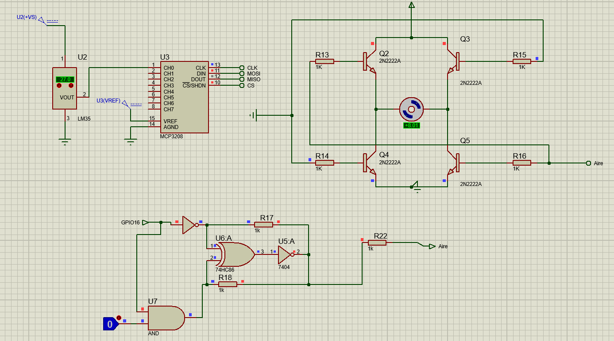

# Manual Tecnico
Para la realización de la práctica 2 se ha  diseñado y construido un prototipo funcional que simule las características iniciales de una "Smart Home". Dicho prototipo fue realizado utilizando una Raspberry Pi Zero W.

En esta práctica se desarrolló un sistema de automatización donde se implementan diversas funcionalidades entre las que se encuentran un sistema de control de acceso, monitoreo de temperatura para la activación de un aire acondicionado, detección de fuego en la cocina con alarmas sonoras y un sistema de iluminación controlado por sensores. Cada una de estas funciones está diseñada para ser manejada y monitoreada a través de una pantalla LCD, garantizando un actualización constante de la información que el sistema maneja.


A continuación se muestra los pines de la Raspberry Pi Zero W que fueron utilizados para cada componente que fue utilizado para el prototipo:


| **LCD** | **Teclado de Ingreso** | **Sensor de Luz** | **Sensor de Temperatura** | **Sensor de Llamas** | **Luces**         |**Motor**      |**Buzzer**      |
| ------- | ---------------------- | ----------------- | ------------------------- | -------------------- | ----------------- |---------------|---------------|
| GPIO2   | GPIO12                 | GPIO27            | GPIO4                     | GPIO17               | GPIO15            |GPIO14         |GPIO18         |
| GPIO3  | GPIO16                 |                   |                           |                      |                   |               |
|   | GPIO20                 |                   |                           |                      |                   |               |  
|        | GPIO21                 |


Previamente se ha realizado una simulación del mencionado prototipo en sistema de simulación Proteus, a continuación se muestran imagenes de los diagramas electronicos realizados.

### Raspberry
Se hizo uso de una Raspberry Pi 4 para la simulación: 


### LCD

Para poder mostrar la información necesaria al usuario se utilizo la pantalla LCD *LM016*. Esta pantalla se mantiene mostrando la temperatura actual que obtiene del sensor de temperatura en la sala y a su vez muestra la fecha actual:


### Entrada Principal
Para asegurar la seguridad de la entrada principal se diseño un sistema con tres diferentes botones y solo al ingresar la secuencia correcta de los botones se da acceso a la casa.

Para manejar el teclado de los botones de acceso, para mandar la letra _A_ se utilizo el pin GPIO12 para mandar una señal positiva a la Raspberry cuando este botón es presionado, para la tecla _%_ se usó el pin GPIO16, para la tecla _1_ se usó el pin GPIO20 y para la tecla _Enter_ se usó el pin GPIO21.
```python 
def check_password_input():
    global Password_comparar, pattern_set, failed_attempts
    while True:
        if GPIO.input(ky_enter) == GPIO.HIGH and not pattern_set:
            pattern_set = True
            Password_comparar = ''
            print("Ingrese Patron:")
            mylcd.lcd_display_string("Ingrese el patron", 1)
            mylcd.lcd_display_string("patron", 2)
            sleep(0.5)
        elif pattern_set:
            if GPIO.input(ky_A) == GPIO.HIGH:
                Password_comparar += 'A'

                print('*' * len(Password_comparar))
                mylcd.lcd_clear()
                mylcd.lcd_display_string("Contra", 1)
                mylcd.lcd_display_string('*' * len(Password_comparar), 2)
                sleep(0.5)
            elif GPIO.input(ky_porcentaje) == GPIO.HIGH:
                Password_comparar += '%'
                print('*' * len(Password_comparar))
                mylcd.lcd_clear()
                mylcd.lcd_display_string("Contra", 1)
                mylcd.lcd_display_string('*' * len(Password_comparar), 2)
                sleep(0.5)
            elif GPIO.input(ky_uno) == GPIO.HIGH:
                Password_comparar += '1'
                print('*' * len(Password_comparar))
                mylcd.lcd_clear()
                mylcd.lcd_display_string("Contra", 1)
                mylcd.lcd_display_string('*' * len(Password_comparar), 2)
                sleep(0.5)
            elif GPIO.input(ky_enter) == GPIO.HIGH:
                print("tecla presionada Enter")
                if Password_comparar == Password:
                    mylcd.lcd_clear()
                    mylcd.lcd_display_string("Contra", 1)
                    mylcd.lcd_display_string("Correcta", 2)
                    print("Contrasenia correcta")
                    GPIO.output(led, GPIO.HIGH)
                    sleep(1)
                    mylcd.lcd_clear()
                    mylcd.lcd_display_string("Bienvenido", 1)
                    sleep(2)
                    mylcd.lcd_clear()
                    pattern_set = False
                    Password_comparar = ''
                    failed_attempts = 0  
                    sleep(0.5)
                    return True
                else:
                    failed_attempts += 1
                    mylcd.lcd_clear()
                    mylcd.lcd_display_string("Intento fallido: ", 1)
                    mylcd.lcd_display_string(str(failed_attempts), 2)
                    sleep(1)
                    mylcd.lcd_clear()
                    mylcd.lcd_display_string("Contra", 1)
                    mylcd.lcd_display_string("Incorrecta", 2)
                    sleep(1)
                    mylcd.lcd_clear()
                    mylcd.lcd_display_string("Pruebe de", 1)
                    mylcd.lcd_display_string("Nuevo", 2)
                    sleep(1)
                    mylcd.lcd_clear()
                    print(f"Intentos fallidos: {failed_attempts}")
                    print("Contrasenia incorrecta")
                    pattern_set = False
                    GPIO.output(led, GPIO.LOW)
                    Password_comparar = ''
                    sleep(0.5)
                    if failed_attempts >= 3:
                        bloquear_entrada(15)
                        failed_attempts = 0  
                    return False
```

Como se muestra en el codigo, al presionar una tecla el caracter se concatena a una variable de tipo _String_ que se encuentra vaciá y al presionar la tecla _Enter_ se hace la comparación del _String_ ingresado con la contraseña ya guardada en el sistema.

Al ingresar la contraseña correcta se envia una señal al pin GPIO22 y se activa una led indicando que el acceso fue exitoso a la vez que se muestra un mensaje en la pantalla LCD:


De ingresar la contraseña incorrecta se muestra en la pantalla LCD que la contraseña es incorrecta.

### Sala
En la sala se cuenta con un sensor de temperatura *LM35*. Una vez este marca una temperatura de 25°C o mayor se activa un motor DC indicando que el aire acondicionado fue activado.

A su vez se cuenta con un botón capaz de encender y apagar el aire acondicionado.



```python
def sensor_temp():
    humidity, temperature = Adafruit_DHT.read_retry(11,4)
    if humidity is not None and temperature is not None:
        mylcd.lcd_clear()
        mylcd.lcd_display_string("Temp={0:0.1f}C".format(temperature))
        mylcd.lcd_display_string(f"{str(now.day)}/{str(now.month)}/{str(now.year)}", 2)
        print("Temp={0:0.1f}C Humidity={1:0.1f}%".format(temperature, humidity))
        GPIO.output(motor,GPIO.HIGH)
        sleep(2)
        GPIO.output(motor,GPIO.LOW)
        if (temperature>=25):
            GPIO.output(motor,GPIO.HIGH)
        else:
            GPIO.output(motor,GPIO.LOW)
    else:
        print("Sensor failure. Check wiring.")
```

Se hace uso de una validación simple del valor de temperatura leido y si es mayor o igual a 25 se manda una señal positiva al pin del aire acondicionado GPIO14 y con el uso de la libreria *datetime* se obtiene la fecha del día y se muestra en la pantalla LCD. Si la temperatura disminuye por debajo de los 25°C entonces se deja de mandar la señal positiva al pin GPIO14 y se apaga el aire acondicionado.

### Cocina

Por seguridad en la cocina se cuenta con un sensor de llamas y al detectar cualquier indicio de un incendio se envia una señal positiva que activa un *Speaker* para poder alertar la detección de fuego.


```python
def sensor_fuego():
    if(GPIO.input(fuego)==0):
        mylcd.lcd_clear()
        mylcd.lcd_display_string("Fuego Detectado", 1)
        sleep(1)
        mylcd.lcd_clear()
        print("Se esta quemando")
        GPIO.output(buzzer,GPIO.HIGH)
    else:
        print("Todo Normal")
        GPIO.output(buzzer,GPIO.LOW)
```


### Habitaciones

En todas las habitaciones del hogar se cuenta con luces led para podre iluminar el hogar. Para poder dismunir el consumo de energía electrica se cuenta con un sensor de luz, el cual se activa si se detecta suficiente luz natural. Al activarse el sensor manda una señal que apaga todas las luces del hogar. Por conveniencia tambien se cuenta con un botón que puede encender y apagar todas las luces en cualquier momento.


```python
def sensor_luz():
    if(GPIO.input(luz)==0):
        print("Luz detectada.")
        GPIO.output(led_luz,GPIO.HIGH)
        mylcd.lcd_clear()
        mylcd.lcd_display_string("Luces Apagadas", 1)
        sleep(1)
        mylcd.lcd_clear()
    else:
        print("No hay luz. Encendiendo leds")
        GPIO.output(led_luz,GPIO.LOW)
```

## Librerías utilizadas 

A continuacion se detallan las librerías utilizadas para la realización del prototipo:


### 1. RPi.GPIO

La librería RPi.GPIO es utilizada para controlar los pines GPIO (General Purpose Input/Output) de la Raspberry Pi. Permite configurar los pines como entradas o salidas y leer o escribir en ellos.

**Características:**
- Configuración de los pines GPIO en modo BOARD o BCM.
- Control de pines digitales de entrada y salida.
- Implementación de interrupciones (eventos) en los pines.

### 2. time.sleep

La función sleep del módulo time es utilizada para pausar la ejecución del programa por un número especificado de segundos.

**Características:**
- Permite introducir retardos en la ejecución del programa.
- Es útil cuando se necesitan pausas temporales.

### 3. I2C_LCD_driver

I2C_LCD_driver es una librería utilizada para controlar pantallas LCD a través de la interfaz I2C. Facilita la comunicación con módulos LCD que usan controladores.

**Características:**
- Simplifica la escritura de texto en pantallas LCD.
- Soporta la manipulación de cursor, desplazamiento de pantalla y caracteres personalizados.

### 4. datetime

Proporciona clases para manipular fechas y tiempos. Es utilizado para trabajar con fechas, horas, intervalos de tiempo y operaciones relacionadas.

**Características:**
- Manejo de fechas y horas con precisión.
- Soporte para zonas horarias y conversión entre ellas.
- Comparación y manipulación de intervalos de tiempo.

### 5. Adafruit_DHT

Adafruit_DHT es una librería utilizada para leer datos de sensores DHT11, DHT22 y AM2302, que miden la temperatura y la humedad.

**Características:**
- Lectura fácil de temperatura y humedad desde sensores DHT.
- Compatible con varios modelos de sensores DHT.

## Consideraciones y restricciones para la instalación del prototipo

A continuación se detallan ciertas consideraciones para la uso de los componenetes requeridos para el funcionamiento del prototipo:

- Se utilizó un sensor de humedad DHT11 que a nivel de software se dispone de librerías con soporte, de esas librerías se utilizo Adafruit_DHT para el buen uso de este componente. En cuanto al hardware, solo es necesario conectar el pin VCC de alimentación a 5V, el pin GND a Tierra (0V) y el pin de datos a un pin digital el cual proporciona la Raspberry Pi Zero W.

- Se utilizó un sensor de llama de 4 pines, dicho componente esta basado en un LED receptor infrarrojo el cual puede detectar longitudes de onda en el rango que las llamas se encuentran. En cuanto a la conexión de este componente se debe de conectar el pin VCC de alimentación a 5V, el pin GND a Tierra (0V) y el pin Do que es una salida digital es la que debe ir conectado a un pin digital el cual proporciona la Raspberry Pi Zero W.

- Se utilizó un MD-FR061 modulo sensor fotoresistencia 4 pines, este modulo cuenta con un potenciómetro ajustable puede ajustar el brillo de la luz detectada. Se debe de conectar el pin VCC de alimentación a 5V, el pin GND a Tierra (0V) y el pin Do que es una salida digital es la que debe ir conectado a un pin digital el cual proporciona la Raspberry Pi Zero W.

- Se hizo uso de una pantalla LCD 16×2 con un módulo I2C que permite agregar un modo de visualizar los mensajes y la interfaz I2C evita que se tenga que usar varios pines. Esta pantalla LCD  es de color azul con un espacio para dos líneas de 16 caracteres.
La dirección I2C por defecto del módulo puede ser 0x3F o en otros casos 0x27. Para el uso de esta se necesito de la librería I2C_LCD_driver.

- Para la realización de este prototipo se utilizo una Raspberry Pi Zero W, a continuación se muestra cierta información acerca de su uso y consideraciones a tomar en cuenta:
    * La Raspberry Pi Zero W es una versión compacta y de bajo costo de la familia Raspberry Pi, diseñada para aplicaciones embebidas, proyectos de IoT y prototipos. La "W" en su nombre indica la inclusión de conectividad inalámbrica (Wi-Fi y Bluetooth).
    - Cuenta con 40 pines GPIO.
    - Posee una ranura para tarjeta microSD (se utiliza para el sistema operativo y el almacenamiento)
    - En relacion a la alimentación es de 5V, 2.5A a través del puerto Micro-USB.
    - El sistema operativo utilizado fue Raspbian.
    - Es esencial usar un adaptador de corriente adecuado (5V, 2.5A) para evitar inestabilidades.
    - Se recomienda usar tarjetas microSD de alta calidad y con buena velocidad de lectura/escritura para mejorar el rendimiento general.

## Costo del prototipo

Para la realización del prototipo en cuestión, se utilizaron diferentes componentes y materiales los cuales se detallan a continuación: 

| **Descripcion** | **Cantidad** | **Precio** | **Total** |
| ------- | ---------------------- | ----------------- | ------------------------- |
| Alambre Rojo                         | 8 metros                 | Q2.00                | Q16.00                 | 
| Alambre Negro                        | 12 metros                 | Q2.00                |  Q24.00                |                
| Modulo sensor fotoresistencia        | 1  unidad                |      Q16.00          | Q16.00                 |                                
| Adaptador para Raspberry             |1 unidad                  |Q99.00                |Q99.00                  |
| Jumpers Macho-Hembra                 |10 unidades               | Q3.59                |Q35.00                  |
|Resistencia 1k                        |5 unidades                |Q0.60                 |Q.3.00                  |
|Sensor de Humedad DH11                |1 unidad                  |Q20.00                |Q20.00                  |
|Pin hembra sencillo                   |1 unidad                  |Q3.00                 |Q3.00                   |
|Pulsador de Enclave Cuadrado          |2 unidades                |Q6.00                 |Q12.00                 |
|Pulsadores                            |4 unidades                |Q8.50                 |Q34.00                  |
|Compuerta XOR                         |1 unidad                  |Q6.00                 |Q6.00                   |
|Mini Interruptor                      |2 unidades                |Q3.00                 |Q6.00                   |
|Madera 13 Madera 10 * 10ml * 80cm     |2 unidades                |Q.3.65                |Q7.30                   |
|Broca 1/2 X 6                         |1 unidad                  |Q.73.35               |Q.73.35                 |
|Pintura Acrilica                      |2 unidades                |Q19.00                |Q38.00                  |
|Masking Tape                          |1 unidad                  |Q4.20                 |Q4.20                   |
|Carton Chip K-60 27.5*39              |1 unidad                  |Q21.50                |Q21.50                  |
|Barras de Silicon                     |1 unidad                  |Q1.00                 |Q1.00                   |
|Regla de Aluminio                     |1 unidad                  |Q6.95                 |Q6.95                   |
|Pistola de Silicon                    |1 unidad                  |Q25.00                |Q25.00                  |
|Carton Piedra                         |1 unidad                  |Q36.00                |Q36.00                  |
|Cable Micro USB  a USB                |2 unidades                |Q31.00                |Q62.00                  |
|Resistencia 10k                       |2 unidades                |Q0.75                 |Q1.50                   |
|Pantalla LCD                          |1 unidad                  |Q39.00                |Q39.00                  |
|Modulo I2c                            |1 unidad                  |Q19.00                |Q19.00                  |
|Buzzer                                |1 unidad                  |Q18.00                |Q18.00                  |
|Sensor LLama 4 pines                  |1 unidad                  |Q18.00                |Q18.00                  |
|Led rojo                              |10 unidades               |Q2.50                 |Q25.00                  |
|1 adaptador HDMI a Micro HDMI         |1 unidad                  |Q16.00                |Q16.00                  |
|Cable OTG a micro USB                 |1 unidad                  |Q21.00                |Q21.00                  |
|Rapberry Pi Zero W                    |1 unidad                  |Q270.00               |Q270.00                  |


En total se gasto Q976.80 para la realización del prototipo requerido para la práctica 2.

